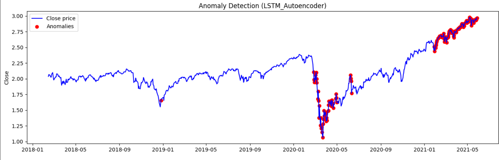
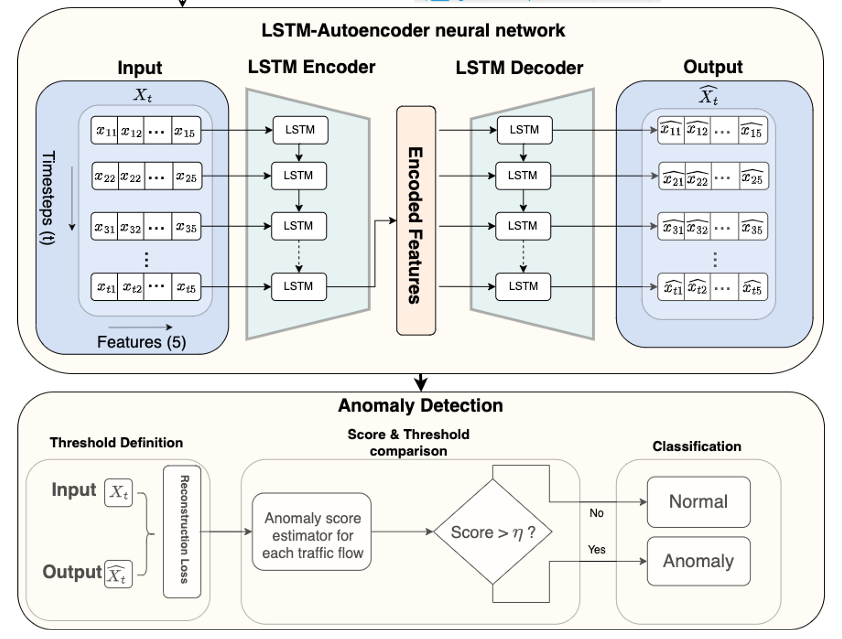

# Usando LSTM-Autoencoder para detectar anomalías en los precios de las acciones del índice NYSE Composite


Este modelo utiliza una arquitectura **LSTM-Autoencoder** para detectar anomalías en el precio del stock del índice NYSE Composite. La **detección de anomalías** permite identificar oportunidades de inversión, prevenir pérdidas o reducir riesgos. 

### Usando LSTM-Autoencoder 


<em>Diagrama elaborado por [Lachekhab y otros](https://www.mdpi.com/1996-1073/17/10/2340)</em>

El modelo combina dos arquitecturas: **LSTM y Autoencoder**. Las redes LSTM tienen la capacidad de manejar grandes cantidades de datos temporales o secuenciales. Mientras que los Autoencoder reconstruyen los datos de entrada. Esto permite identificar el umbral óptimo basado en las tasas de error (Error Absoluto Medio) de reconstrucción evaluadas en todas las secuencias.
Dentro del notebook se comparó el rendimiento y la detección de anomalías con un modelo autoencoder común. 
Los resultados muestran que ambos modelos lograron detectar la caída de precios en 2020, sin embargo el modelo LSTM-Autoencoder logró detectar los **máximos históricos a principios de 2021**. 

### Cómo ejecutarlo
- Carga el notebook en google colab y [descarga el dataset](https://www.kaggle.com/datasets/mattiuzc/stock-exchange-data)

- Si necesitas ejecutarlo localmente, debes tener instalado los siguientes módulos:
```
pip install tensorflow pandas matplotlib numpy scikit-learn jupyter
```
### Dataset y preprocesamiento de datos
La red fue entrenada con los precios de cierre diarios del [NYSE Composite Index](https://www.kaggle.com/datasets/mattiuzc/stock-exchange-data). Los datos fueron normalizados y limpiados para transformarlos en secuencias de 30 pasos.
