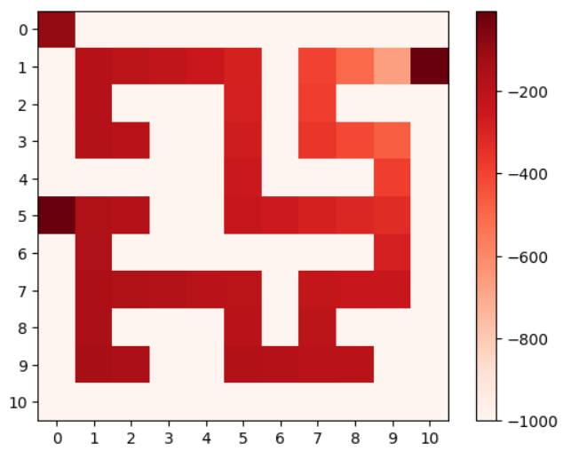

# Usando Q-learning (aprendizaje por refuerzo) para resolver laberintos
 
 


El **Q-learning** consiste en asignarle un valor de calidad a cada acción dado un estado, de modo que se genere una tabla Q que permita al agente **tomar decisiones informadas**. La tabla Q se rellena a partir de la interacción del agente con el laberinto, donde cada acción se verá recompensada o penalizada según su impacto en el objetivo.

Los modelos de aprendizaje reforzado que resuelven laberintos, como el Q-learning, tienen aplicaciones directas como **optimización de rutas**, **generación de niveles de videojuegos**, **simular procesos** y **guiar robots**, entre otras que involucren navegación y toma de decisiones en entornos complejos.

Cada valor de Q se actualiza mediante la siguiente expresión:

$$
\begin{equation}
Q(s, a) \leftarrow Q(s, a) + \alpha (r + \gamma \max_{a'} Q(s', a') - Q(s, a))
\end{equation}
$$

**Alpha (α)**: Es el factor de aprendizaje, que controla la velocidad a la que el agente aprende de sus experiencias.

**Gamma (γ)**: Es el factor de descuento, que determina la importancia de las recompensas futuras en comparación con las actuales.

**r**: Es la recompensa que el agente recibe por tomar la acción a en el estado s.

El agente tiene una **menor penalización** si se aleja del punto de inicio. Con esto, se busca motivarlo a explorar más el entorno, lo cual se traduce en un menor tiempo de convergencia y generar tablas Q con más facilidad. Por supeusto, consigue una alta recompensa si llega al final.

### Notebooks

 
 


En primer lugar, se realizó un notebook para resolver laberintos 14x14. Luego, se utilizó el mismo notebook para resolver laberintos 5x5. Si es necesario 
cambiar la dimensión del laberinto, solo debes cambiar el valor de `MAZE_DIMENSION`. 


### Dependencias
- [numpy](https://numpy.org/install/)  
- [mazelib](https://github.com/john-science/mazelib?tab=readme-ov-file)
- [matplotlib](https://matplotlib.org/stable/install/index.html)
- [pandas](https://pandas.pydata.org/docs/getting_started/install.html)
- [scikit-learn](https://scikit-learn.org/stable/install.html)
- [jupyter](https://jupyter.org/install)

### Cómo ejecutarlo
- Carga uno de los notebooks a google colab

- Si necesitas ejecutarlo localmente, debes tener instalado los siguientes módulos:
```
pip install pandas matplotlib numpy scikit-learn jupyter
```
Adicionalmente, necesitarás clonar el repositorio de `mazelib`

### Futuro
Para futuros proyectos, se puede utilizar el presente algoritmo para generar un gran dataset de **laberintos** y **tablas Q**, los cuales servirían de insumos para otros modelos, como **redes neuronales convolucionales**. 
