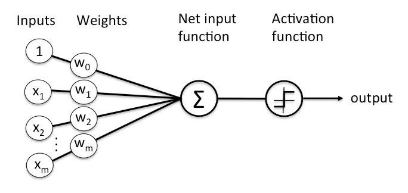

# Perceptrón *from scratch*


Implementación de un modelo perceptrón para tareas de clasificación binaria y regresión. Cada característica se le asigna un peso que influye en el resultado final, luego de aplicar la función de activación correspondiente.

La función de activación **identidad** mantendrá la regresión lineal.

La función de activación **escalonada** permitirá la clasificación binaria


### Función de costo y algoritmo de optimización
Fue utilizado el **error cuadrático medio** como **función de costo** 

$$
MSE = \frac{1}{n} \sum_{i=1}^{n} (y_i - \hat{y}_i)^2
$$

se escogió el algoritmo de **descenso de gradiente** para la optimización. 

$$
\frac{\partial E}{\partial w_{ij}} = \frac{\partial E}{\partial \hat{y}} \frac{\partial \hat{y}}{\partial z_i} \frac{\partial z_i}{\partial w_{ij}}
$$

$$
w_{ij}^{nueva} = w_{ij}^{antigua} - \alpha \frac{\partial E}{\partial w_{ij}}
$$
### Cómo ejecutarlo
- Carga el notebook en google colab y [descarga el dataset](https://www.kaggle.com/datasets/shubham47/students-score-dataset-linear-regression)

- Si necesitas ejecutarlo localmente, debes tener instalado los siguientes módulos:
```
pip install pandas matplotlib numpy scikit-learn seaborn jupyter
```
### Dataset y preprocesamiento de datos

Para la tarea de clasificación de vinos, se utilizó el dataset de scikit-learn, y con ello se seleccionan las características de Alcohol, Magnesio e intensidad de color, debido a que son **linealmente separables**. 

Por el otro lado, se probó el modelo para tareas de regresión con el dataset  [Students Score Dataset](https://www.kaggle.com/datasets/shubham47/students-score-dataset-linear-regression).
